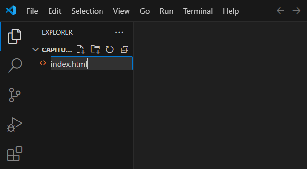

# Práctica 1. Creando una página web con HTML5, CSS y JS.

## Objetivo de la práctica:
Al finalizar la práctica, serás capaz de:
- Aprender a crear una página web.
- Usar los elementos básicos de una página con HTML.
- Aplicar estilos a la página creada.
- Agregar código JavaScript.

## Objetivo visual:
Al realizar la práctica podrás ver en el navegador la siguiente imagen:


## Duración aproximada:
- 30 minutos.

## Tabla de ayuda:

| Requisito | Descripción|
| --- | --- |
| Editor Código | Un editor de texto como VSCode, Sublime Text o similar. |
| Terminal | Acceso a la terminal de comandos del sistema. |

## Instrucciones 

### Tarea 1. Descripción de la tarea a realizar.

**Paso 1.** Crea el directorio de trabajo `DesarrolloWeb` y los directorios para cada capítulo. 

Abre una ventana de línea de comandos CMD en tu directorio default.

Crea el directorio `DesarrolloWeb`.

Cámbiate al directorio `DesarrolloWeb` y crea un directorio por cada capítulo del curso.


**Paso 2.** Cámbiate al directorio `capitulo1` e invoca el Visual Studio Code.


**Paso 3.** Crea la página web inicial:

Entra a tu editor de código y crea un nuevo archivo con la extensión `.html`, por ejemplo: `index.html.`



**Paso 4.** Estructura básica HTML:

Escribe el siguiente código en tu archivo `index.html`:

### HTML
```
<!DOCTYPE html>
<html lang="es">
<head>
    <meta charset="UTF-8">
    <meta name="viewport" content="width=device-width, initial-scale=1.0">
    <title>Saludo</title>
    <link rel="stylesheet" href="styles.css">   

</head>
<body>
    <h1>¡Hola, mundo!</h1>
    <p>Esta es mi primera página Web.</p>
    <script src="script.js"></script>
</body>
</html>
```

**Explicación:**

`<!DOCTYPE html>`: Declara el tipo de documento.

`<html>`: Raíz de la página.

`<head>`: Contiene metadatos y enlaces a archivos externos.

`<body>`: Contiene el contenido visible de la página.

`<title>`: Define el título que aparece en la pestaña del navegador.

`<link>`: Enlaza el archivo CSS styles.css.

`<script>`: Enlaza el archivo JavaScript script.js.

**Paso 5.** Crea los archivos CSS y JavaScript:

Crea dos archivos nuevos en la misma carpeta que `index.html`:
    
- Para el estilo:

        styles.css

- Para el código JavaScript:

        script.js

**Paso 6.** Estiliza con CSS:

En el archivo `styles.css` agrega reglas CSS para cambiar la apariencia de los elementos:

### CSS
```
body {
    font-family: Arial, sans-serif;
    text-align: center;
}

h1 {
    color: blue;
}
```

**Paso 7.** Agrega interactividad con JavaScript:

En el archivo `script.js` escribe código JavaScript para agregar funcionalidad. Por ejemplo, puedes cambiar el color
del texto al hacer clic en él:

### JavaScript

```
const h1 = document.querySelector('h1');

h1.addEventListener('click', () => {
    h1.style.color = 'red';
});
```

**Paso 8.** Abre el archivo en tu navegador:

Haz doble clic en `index.html` para abrirlo en tu navegador.


### Resultado esperado:

Despliegue de la página `index.html` de manera inicial:


Despliegue de la página `index.html` después de dar clic en el mensaje "¡Hola mundo!".


## [Índice:](../README.md)
## - [Práctica 2. Instalación del Software de Desarrollo Web.](../Capítulo2/README.md)
